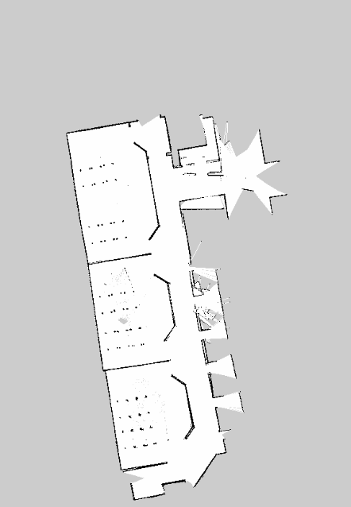

# Homework2 #
##### Homework 2 - Laboratorio ciberfisico #####

### Descrizione

Studenti partecipanti al progetto:
- Faggion Andrea
- Mainenti Matteo
- Testolin Leonardo

L'obbiettivo del secondo homework si basa sulla creazione di un ambiente virtuale utilizzabile da Gazebo assieme a turtlebot3 simulare lo spostamento di un robot attraverso lo spazio creato a scelta dagli studenti.
Abbiamo scelto di rappresentare il piano terra dell'università degli studi di Verona, nel dipartimento di informatica, sezione Ca' vignal 1.

Per costruire l'ambiente virtuale ci siamo basati sulla cartina del piano, così da avere un'idea precisa delle misure da utilizzare, dopodichè abbiamo aggiunto muri, finestre e banchi utilizzando gli editor presenti all'interno di Gazebo,

Ruoli all'interno dell'homework:
- Ca' vignal 1,parte esterna/giardino - Faggion Andrea
- Ca' vignal 1, lato sinistro, aule ABC. Aggiunta banchi - Mainenti Matteo
- Ca' vignal 1, parte destra, aule DEF.  - Testolin Leonardo

Ci siamo spartiti i compiti nel ruolo indicato, ognuno ha costruito la propria parte di piano ed eseguito la mappatura con rviz (e il video della navigazione ) in maniera autonoma, dopodichè abbiamo solo unito le tre componenti per creare il  file World finale.


### Installazione

Come da richiesta è stato creato il file di setup  presente sulla repository principale.
Per lanciarlo eseguire il comando
```sh
$ ./setup.sh
```
dopodichè per iniziare la simulazione bisogna eseguire le seguenti istruzioni:
```sh
$ export TURTLEBOT3_MODEL=waffle
$ roslaunch turtlebot3_gazebo turtlebot3_cv1.launch
```
Per la navigazione autonoma:
```sh
$ roslaunch turtlebot3_gazebo turtlebot3_simulation.launch
```

### Mappa

Per mappare le parti di corridoio abbiamo utilizzato turtlebot3_teleop, ovviamente insieme a gazebo e rviz.

```sh
$ roslaunch turtlebot3_slam turtlebot3_slam.launch
$ rosrun rviz rviz -d `rospack find turtlebot3_slam`rviz/turtlebot3_slam.rviz
$ roslaunch turtlebot3_teleop turtlebot3_teleop_key.launch
$ rosrun map_server map_saver -f $HOME/snukne/catkin_ws/src/homework2/mappaCv1Dx
```
Matteo Mainenti <br>
<br>
Leonardo Testolin <br>
<br>
Andrea Faggion <br>
<br>

Per la navigazione autonoma è stato usato turtlebot3_navigation.

```sh
$ roslaunch turtlebot3_navigation turtlebot3_navigation.launch map_file:=$HOME/home/snukne/catkin_ws/src/homework2/mappaCv1Dx.yaml
$ rosrun rviz rviz -d `rospack find turtlebot3_navigation`rviz/turtlebot3_nav.rviz
```

Video del progetto  risultante, contenente tutte e tre le parti, sottostante

### Filmato


Info <b>Licenza</b>: <br>
[View License](https://github.com/snukneLeo/homework2/blob/master/LICENSE)
